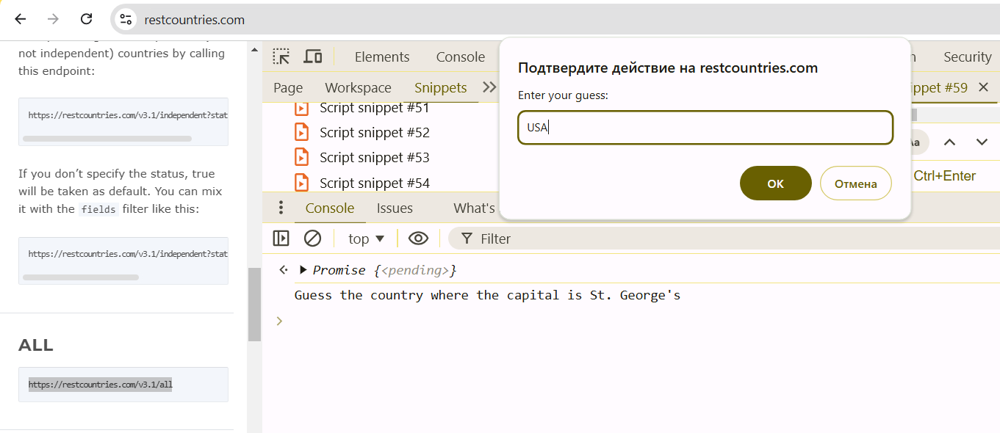
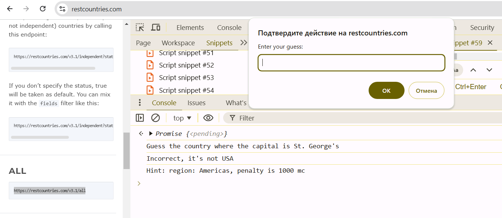
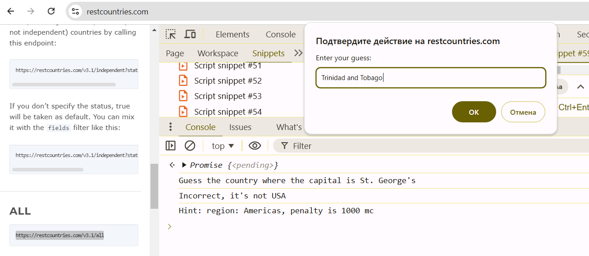
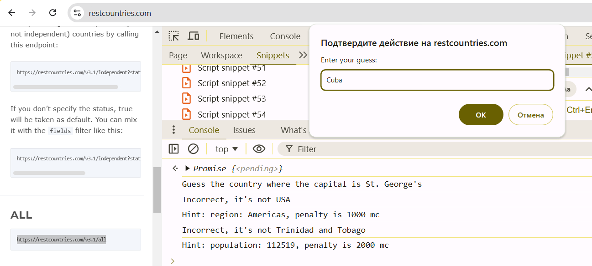
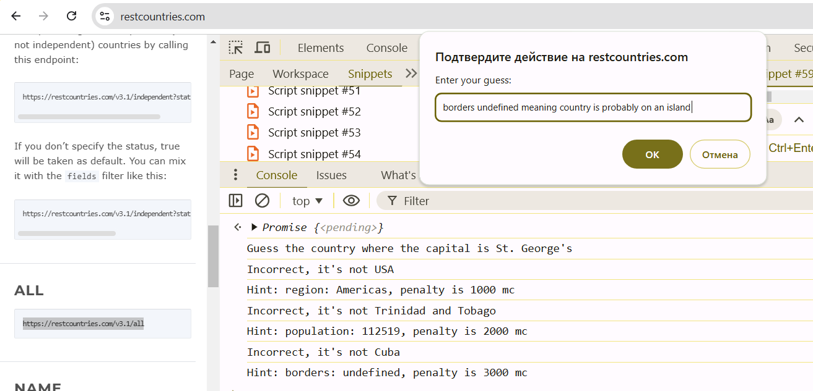
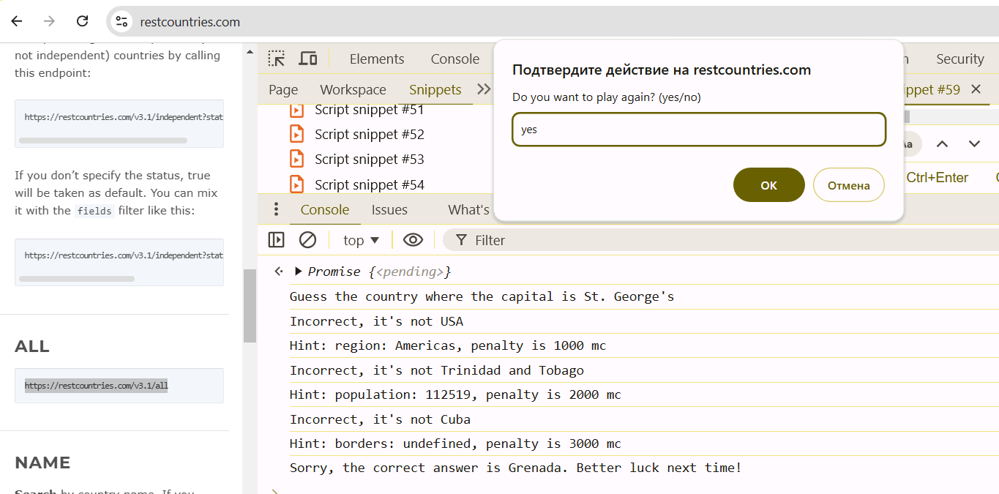
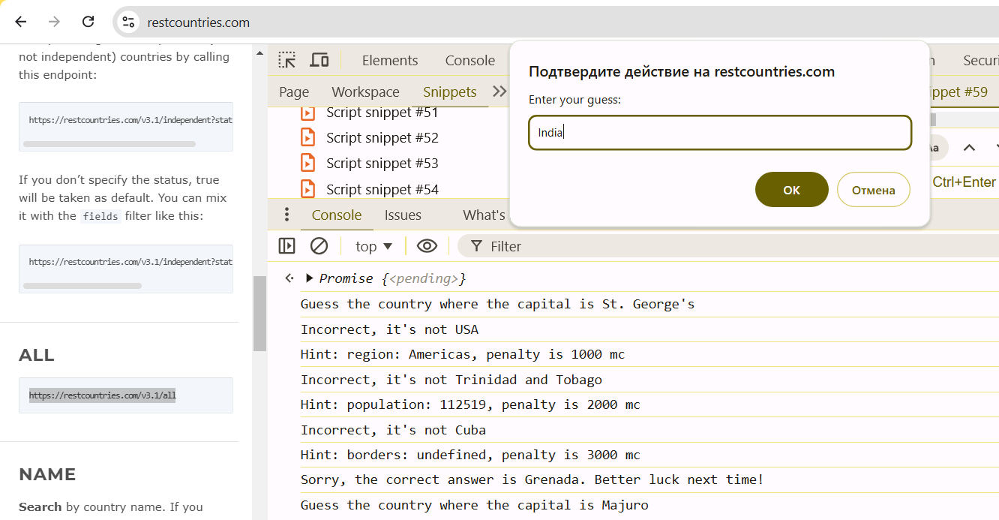
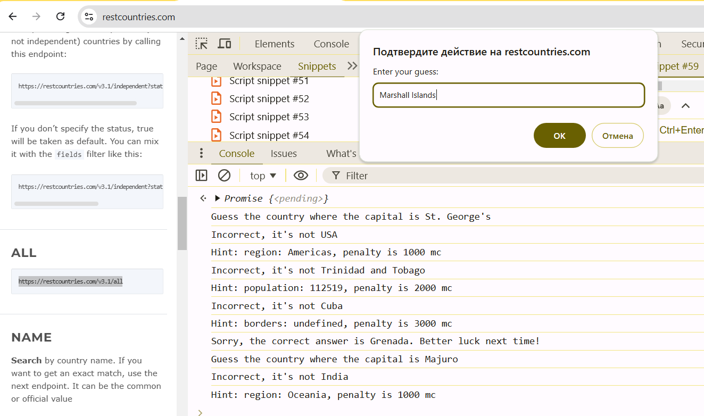
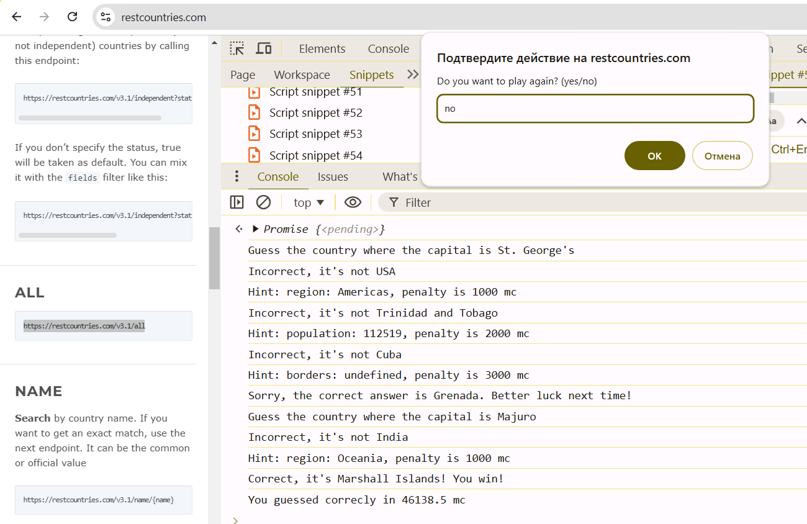

# Test 01: JavaScript Game Countries and Capitals

## Task description

Write a program that implements the "Guess the Country by its Capital" game in a browser. In this game, the player is given a capital of a randomly selected country, and he/she has to guess the name of that country. The player has 3 attempts to enter his guess in the browser prompt. After each wrongly guess the player is getting a hint as string in the browser console. The first hint is about the region of the country, the second is about population and the last one is about borders (short list of coutries given country has the same borders with). Each hint with a certain penalty (time in mc). If the player guesses the country correctly, they are told they have won, and the time they spent guessing, including penalties for hints, is displayed (in mc). If the player does not guess the country correctly, they are given the correct answer and asked if they want to play again. The game continues until the player decides to stop.

## Working demo of the game

  
Game start, first guess

  

First guess wrong, second guess

 
 

Second guess wrong, third guess

 

Third guess wrong, game over, possility to start again or no

Game restart, first guess

First guess wrong, second guess

Second guess correct, game winner, possiblity to restart

## Requirements

- Programming language: JavaScript
- Working environment: Browser
- Run your code in Browser Snippets: Chrome Dev Tools -> Sources tab -> Snippets sub tab on the left -> + New snippet button
  - **ATTENTION for those who will use https://restcountries.com/v3.1/all API: you must open a website https://restcountries.com/ in a new browser tab and open Chrome Dev Tools while you are on this website tab**

## Scoring - total maximum is 10, possible is 0-10.

Each completed task costs specified amount of points.

**If your solution doesn't work in Snippets (Syntax Errors in console, Runtime Errors in console, etc), you will be given total 0 points for the whole test. During the testing of your code, there won't be test cases when the player enters something in prompt that might broke your code. All test cases will contain strings with spaces (emulation of correct user behaviour)**

### List of countries - choose one to implement

#### Create your own list of countries and capitals - 1 point

You could create an array of countries with capitals and other info and use it in your game. Pay attention to the country properties that must be defined for each country: name of the country, name of the capital, number of population, array of strings of names of neighboor countries (common borders)

#### Load list of countries from the https://restcountries.com/v3.1/all - 2 points

You could load an array of countries with capitals and other info and use it in your game. To do so, use browser fetch function and url `https://restcountries.com/v3.1/all`.

You are free to choose Promise handing using then/catch or try, catch async/await

If you choose this approach, then use `common.name` as name value for a country, `capital` as capital name value for a country, `region` as region name value for a country, `population` as population number value for a country, and `borders` array of strings for a country

Pay attention that there are several countries where there are more than one capital

  
Example

  A country object from API (Sweden)
  <pre>
    {
    "name": {
        "common": "Sweden",
        "official": "Kingdom of Sweden",
        "nativeName": {
            "swe": {
                "official": "Konungariket Sverige",
                "common": "Sverige"
            }
        }
    },
    "tld": [
        ".se"
    ],
    "cca2": "SE",
    "ccn3": "752",
    "cca3": "SWE",
    "cioc": "SWE",
    "independent": true,
    "status": "officially-assigned",
    "unMember": true,
    "currencies": {
        "SEK": {
            "name": "Swedish krona",
            "symbol": "kr"
        }
    },
    "idd": {
        "root": "+4",
        "suffixes": [
            "6"
        ]
    },
    "capital": [
        "Stockholm"
    ],
    "altSpellings": [
        "SE",
        "Kingdom of Sweden",
        "Konungariket Sverige"
    ],
    "region": "Europe",
    "subregion": "Northern Europe",
    "languages": {
        "swe": "Swedish"
    },
    "translations": {
        "ara": {
            "official": "مملكة السويد",
            "common": "السويد"
        },
        "bre": {
            "official": "Rouantelezh Sveden",
            "common": "Sveden"
        },
        "ces": {
            "official": "Švédské království",
            "common": "Švédsko"
        },
        "cym": {
            "official": "Kingdom of Sweden",
            "common": "Sweden"
        },
        "deu": {
            "official": "Königreich Schweden",
            "common": "Schweden"
        },
        "est": {
            "official": "Rootsi Kuningriik",
            "common": "Rootsi"
        },
        "fin": {
            "official": "Ruotsin kuningaskunta",
            "common": "Ruotsi"
        },
        "fra": {
            "official": "Royaume de Suède",
            "common": "Suède"
        },
        "hrv": {
            "official": "Kraljevina Švedska",
            "common": "Švedska"
        },
        "hun": {
            "official": "Svéd Királyság",
            "common": "Svédország"
        },
        "ita": {
            "official": "Regno di Svezia",
            "common": "Svezia"
        },
        "jpn": {
            "official": "スウェーデン王国",
            "common": "スウェーデン"
        },
        "kor": {
            "official": "스웨덴 왕국",
            "common": "스웨덴"
        },
        "nld": {
            "official": "Koninkrijk Zweden",
            "common": "Zweden"
        },
        "per": {
            "official": "پادشاهی سوئد",
            "common": "سوئد"
        },
        "pol": {
            "official": "Królestwo Szwecji",
            "common": "Szwecja"
        },
        "por": {
            "official": "Reino da Suécia",
            "common": "Suécia"
        },
        "rus": {
            "official": "Королевство Швеция",
            "common": "Швеция"
        },
        "slk": {
            "official": "Švédske kráľovstvo",
            "common": "Švédsko"
        },
        "spa": {
            "official": "Reino de Suecia",
            "common": "Suecia"
        },
        "srp": {
            "official": "Краљевина Шведска",
            "common": "Шведска"
        },
        "swe": {
            "official": "Konungariket Sverige",
            "common": "Sverige"
        },
        "tur": {
            "official": "İsveç Krallığı",
            "common": "İsveç"
        },
        "urd": {
            "official": "مملکتِ سویڈن",
            "common": "سویڈن"
        },
        "zho": {
            "official": "瑞典王国",
            "common": "瑞典"
        }
    },
    "latlng": [
        62,
        15
    ],
    "landlocked": false,
    "borders": [
        "FIN",
        "NOR"
    ],
    "area": 450295,
    "demonyms": {
        "eng": {
            "f": "Swedish",
            "m": "Swedish"
        },
        "fra": {
            "f": "Suédoise",
            "m": "Suédois"
        }
    },
    "flag": "🇸🇪",
    "maps": {
        "googleMaps": "https://goo.gl/maps/iqygE491ADVgnBW39",
        "openStreetMaps": "https://www.openstreetmap.org/relation/52822"
    },
    "population": 10353442,
    "gini": {
        "2018": 30
    },
    "fifa": "SWE",
    "car": {
        "signs": [
            "S"
        ],
        "side": "right"
    },
    "timezones": [
        "UTC+01:00"
    ],
    "continents": [
        "Europe"
    ],
    "flags": {
        "png": "https://flagcdn.com/w320/se.png",
        "svg": "https://flagcdn.com/se.svg",
        "alt": "The flag of Sweden has a blue field with a large golden-yellow cross that extend to the edges of the field. The vertical part of this cross is offset towards the hoist side."
    },
    "coatOfArms": {
        "png": "https://mainfacts.com/media/images/coats_of_arms/se.png",
        "svg": "https://mainfacts.com/media/images/coats_of_arms/se.svg"
    },
    "startOfWeek": "monday",
    "capitalInfo": {
        "latlng": [
            59.33,
            18.05
        ]
    },
    "postalCode": {
        "format": "SE-### ##",
        "regex": "^(?:SE)*(\\d{5})$"
    }
}
  </pre>

  Your country object for a game
  <pre>
    {
    "name": "Sweden",
    "capital": [
        "Stockholm"
    ],
    "region": "Europe",
    "borders": [
        "FIN",
        "NOR"
    ],
    "population": 10353442,
}
  </pre>

### Select a country from the list for the new game - choose one to implement

#### Select countries one by one from the list - 1 points

#### Select random country from the list - 1.5 points

### Game process - choose one to implement

#### Level 1 game process (one guess for the player) - 3.5 points

- Select a country, output its capital for the player
- Handle his guess
- If the guess of a country is correct, the games ends and the player is winner
- Otherwise the game ends and the player is loser
- At the end of the game you must ask the player if he/she wants to play one more game. He must type 'yes' in the prompt and the game must be restarted with the new country and capital. He must type 'no' in the prompt and the game ends completly.

#### Level 2 game process (3 guesses for the player) - 4.5 points

- Select a country, output its capital for the player
- Player has maximum 3 guesses.
- If the guess of a country is correct, the games ends and the player is winner
- Otherwise if there are some amount of guesses left, the game continues and the player can enter one more guess. Otherwise the game ends and the player is loser
- At the end of the game you must ask the player if he/she wants to play one more game. He must type 'yes' in the prompt and the game must be restarted with the new country and capital. He must type 'no' in the prompt and the game ends completly.

#### Level 3 game process (3 guesses and hints after wrong guesses) - 5.5 points

- Select a country, output its capital for the player
- Player has maximum 3 guesses.
- If the guess of a country is correct, the games ends and the player is winner
- Otherwise if there are some amount of guesses left, the game continues. Output the hint for the player. The first hint must be the value of region of the country. The second hint must be about population of the country. And the last hint must contain the list of countries name which have the common borders with the given country. The player can enter one more guess. Otherwise the game ends and the player is loser
- At the end of the game you must ask the player if he/she wants to play one more game. He must type 'yes' in the prompt and the game must be restarted with the new country and capital. He must type 'no' in the prompt and the game ends completly.

#### Level 4 game process (3 guesses, hints with penalties in mc after wrong guesses and calculate time in mc the player spent to win the game) - 6.5 points

- Select a country, output its capital for the player
- Start calculating time (hint: in javascript there is a function performance.now())
- Player has maximum 3 guesses.
- If the guess of a country is correct, the games ends and the player is winner. Output the correct answer and the time in mc
- Otherwise if there are some amount of guesses left, the game continues. Output the hint for the player and add penalty time in mc to his final time. The first hint must be the value of region of the country. The second hint must be about population of the country. And the last hint must contain the list of countries name which have the common borders with the given country. The player can enter one more guess. Otherwise the game ends and the player is loser
- At the end of the game you must ask the player if he/she wants to play one more game. He must type 'yes' in the prompt and the game must be restarted with the new country and capital. He must type 'no' in the prompt and the game ends completly.

## Possible cheating attention

If your solution will be similar to the solutions of other students or AI bots, all students and you will be given 0 points. After all students have been graded, the controversial cases can be discussed:

- you may be asked theoretical questions
- you may be asked questions about your solution
- there may be requests to make changes to your solution
- there may be requests to solve small practical tasks

## How to submit your solution to moodle

### HR/HRO
- Complete task https://github.com/School-of-Digital-Competencies/js-ts-tasks/tree/test-01-js-game-countries-and-capitals

- Upload your solution to https://jsfiddle.net/:
  - Open https://jsfiddle.net/ 

  - Paste your solution into JavaScript section 

  - In the top right corner click on cloud with arrow icon (next to run button) 

  - Copy url from browser (example url "https://jsfiddle.net/mgsdgds3") 

  - **Open that url in the new browser tab (incognito mode) to check that all is fine and you see your solution**

  - Submit only that url into moodle assigment
    
  - P.S. If jsfiddle is not working for you, you could publish your solution on any platfrom you know which supports file sharing by link (and doesn't require auth)
