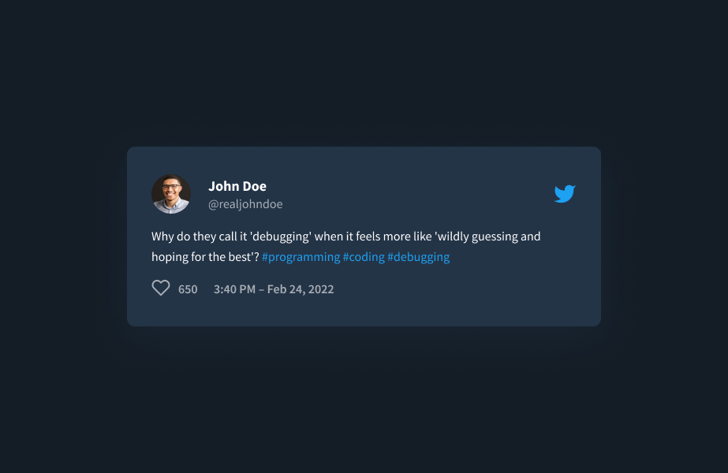
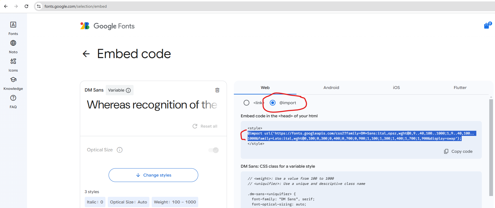
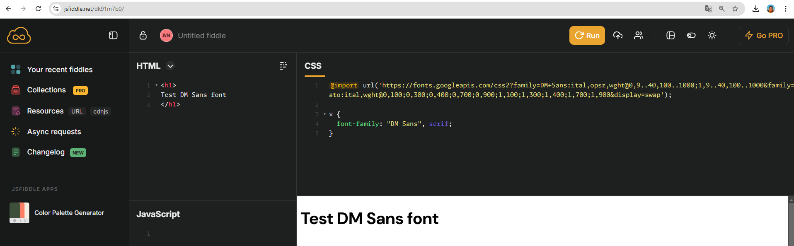
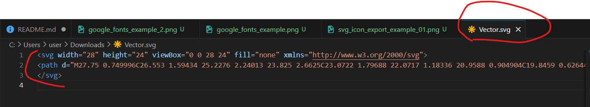
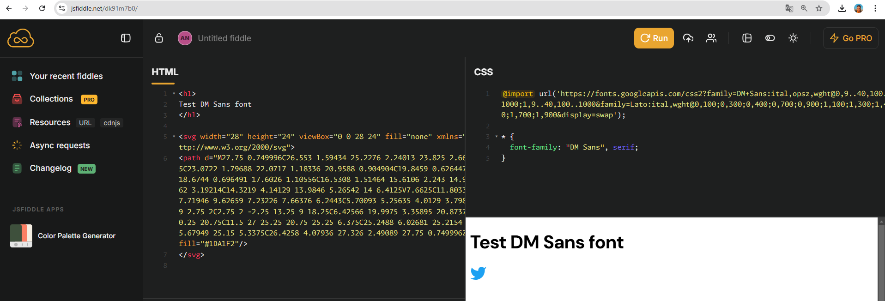

# Test 02: HTML CSS Twitter Card

## Task description

Write HTML CSS code for former Twitter tweet. HR and HRO students must provide solution for dark themed Tweet, and LR students - light theme variant.

## Design (images)

<details>
  <summary>Light theme (LR Students only)</summary>
  
</details>
<details><summary>Dark theme (HR and HRO Students only)</summary>
 
</details>

## Design (Figma)

Figma design link https://www.figma.com/design/ZnQ0IxVzG6VGku4KvZQf7Q/Twitter-Embed-(Community)?node-id=2-44&t=62nnNEExby4vLGgj-0

Don't forget to navigate to Pages -> UI Design

## Requirements

- Stack: HTML5, CSS3
- Working environment: Browser ([jsfiddle](https://jsfiddle.net/) platform)
- No any libraries or framework allowed

## Scoring - total maximum is 10, possible is 0-10.

Each completed task costs specified amount of points.

**If your solution doesn't work in JSFiddle (design is not the same at provided in Figma), you will be given total 0 points for the whole test**

### Open, register and login to your account in https://jsfiddle.net/ - 1 point

By default, you need to use section HTML to write HTML code and CSS section for CSS code

`Run` button in the top right corner is used to run your code and preview it in the bottom right section (Result section)

Registration and login might be need to share a link to your solution. If it's possible to share link without registration - it's okay

### Use correct colors (background, fonts, icons, etc) - 1 point

All colors must be used from Figma file. No custom colors are allowed

### Use correct font - 1 point

Fonts could be imported from https://fonts.google.com/:

- Search for the font
- Open it
- Click on `Get font` blue button in the top right corner
- Click on `Get embed code`
- Under `Web` select radio button with a label `@import` (by default `<link>` is selected)
- From the section `Embed code in the <head> of your html` copy code **inside** `<style> </style>` tags
- Paste copied code (started from `@import url('httpsL//fonts.google...');`) at the beginning of CSS section in jsfiddle

Example importing font named DM Sans

<details>
  <summary>Google Fonts import</summary>
  
</details>
<details><summary>jsfiddle</summary>
 
</details>

### Use svg icons exported from Figma - 1 point

- Open Figma design
- Left click on the icon you need to export from Figma (several left clicks might be need until you select desired icon)
- In the right panel open `Properties` tab
- In the last section named `Export` select SVG and click on `Export ...` button
- Open downloaded file in VSCode or other code editor
- Copy all content from file
- Paste into HTML section in jsfiddle

<details>
  <summary>Export from</summary>
  
</details>
<details><summary>copy svg content</summary>
 
</details>
<details><summary>jsfiddle</summary>
 
</details>

### Provide solution for avatar image, name surname, id and tweet icon - 1 point

Data could be used from Figma (John Doe, @realjohndoe, his avatar and tweet icon)

### Provide solution for tweet text with hashtags - 1 point

Data could be used from Figma (Why do they call it 'debugging' when it feels more like 'wildly guessing and hoping for the best'? #programming #coding #debugging)

### Provide code for heart icon, counter, time and date - 1 point

Data could be used from Figma (650, 3:40 PM - Feb 24, 2022)

### Custom data for tweet content - 3 points maximum

You are free to choose some famous person and use his data for your tweet

- use his photo as avatar, his name, surname and imaginery nickname - 1 point
- use his famous phrase you like and imaginery hashtags - 1 points
- use some time and data from his living years - 1 points

Example

```
Hans Zimmer
@hanszimmer

I write film music. I don't do brain surgery. I don't cure cancer. I just write a little bit of film music. #music #films #truestory

432, 4:50 PM - Jan 31, 2025

```

## Possible cheating attention

If your solution will be similar to the solutions of other students or AI bots, all students and you will be given 0 points. After all students have been graded, the controversial cases can be discussed:

- you may be asked theoretical questions
- you may be asked questions about your solution
- there may be requests to make changes to your solution
- there may be requests to solve small practical tasks

## How to submit your solution to moodle

- Complete task https://github.com/School-of-Digital-Competencies/js-ts-tasks/tree/test-02-html-css

- Share link to your solution from https://jsfiddle.net/:

  - In the top right corner click on cloud with arrow icon (next to run button) 

  - Copy url from browser (example url "https://jsfiddle.net/mgsdgds3") 

  - **Open that url in the new browser tab (incognito mode) to check that all is fine and you see your solution**

  - Submit only that url into moodle assigment

  - P.S. If jsfiddle is not working for you, you could publish your solution on any platfrom you know which supports file sharing by link (and doesn't require auth)
